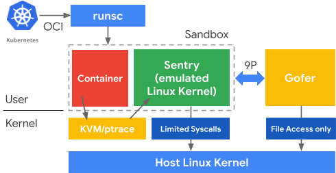
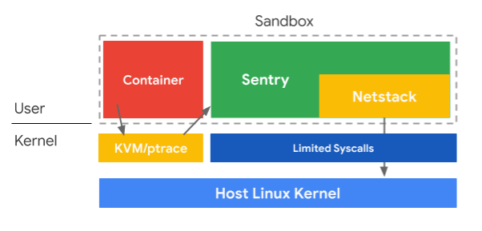
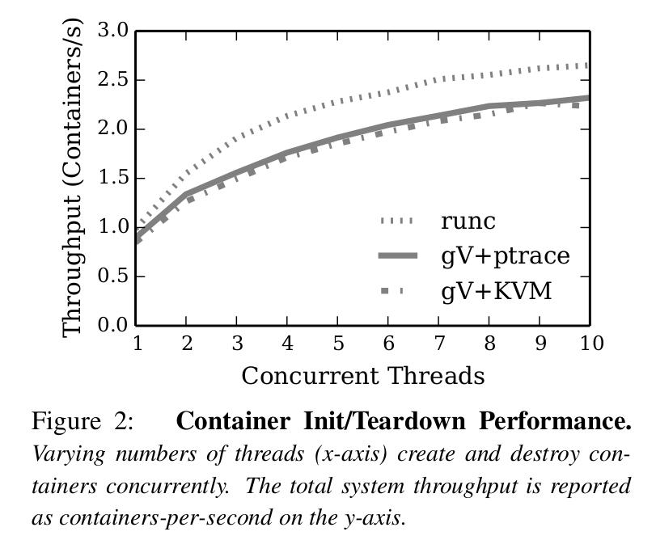
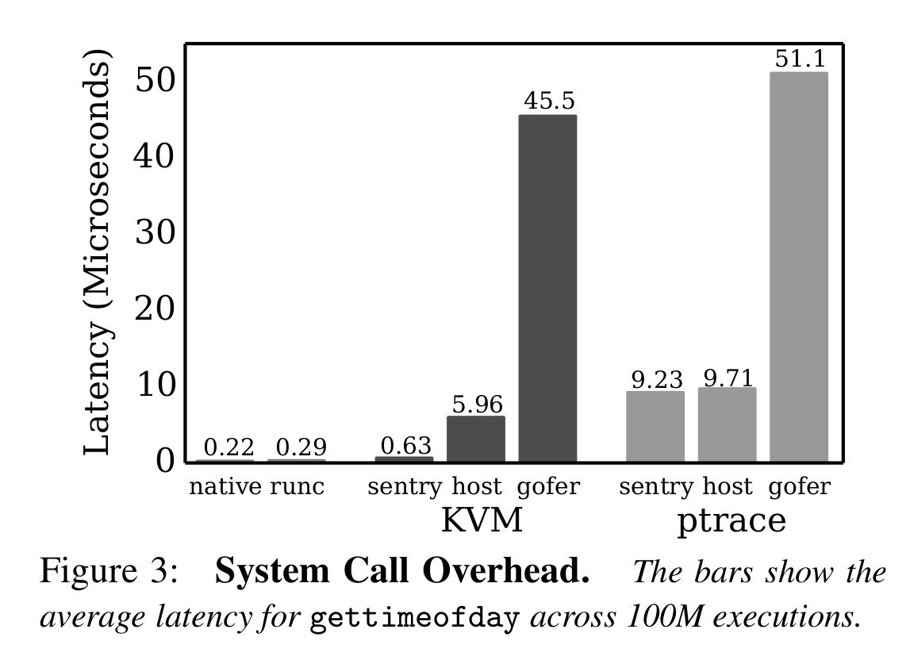
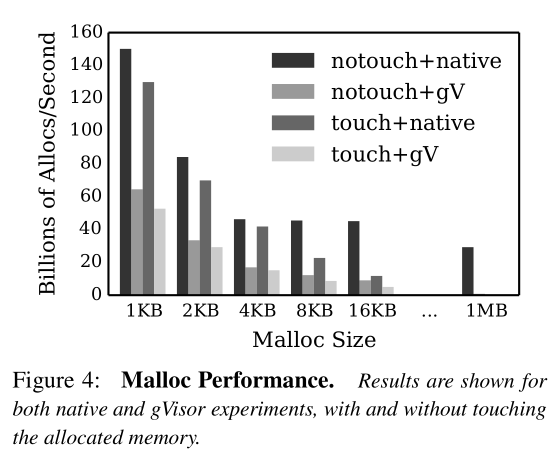
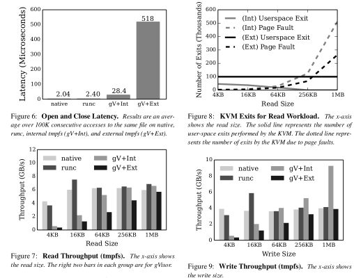
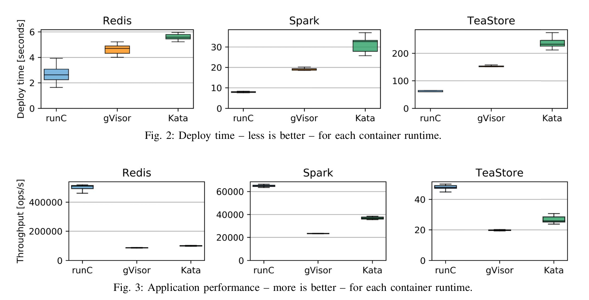
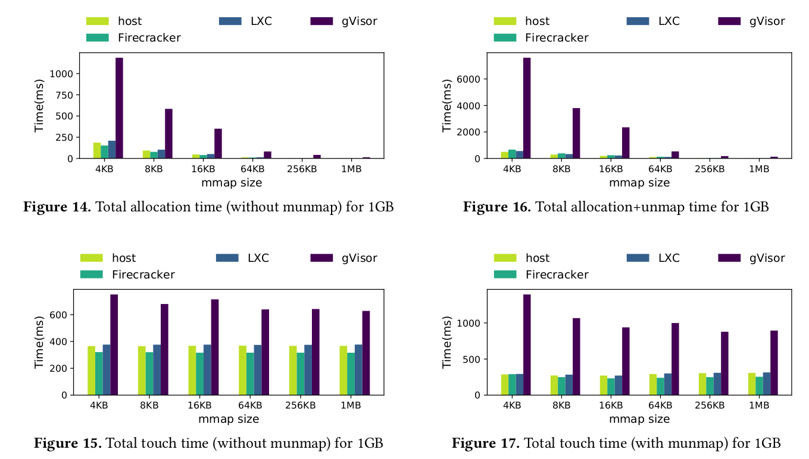

# gVisor Report

## Intro (summary, core domain)
gVisor is a container sandboxer that aims to provide highly isolated environments in which to execute less than fully trusted applications while solving a multitude of problems and inaptitudes inherent to containers and sandboxing with virtual machines.

In recognition of the gaps in isolation resulting from all containers sharing a single host operating system and all VMs sharing a hypervisor, gVisor provides a user-level implementation of Linux - the Sentry. This user-level application provides the system API to containerized applications while preventing any untrusted application from directly interacting with the host OS. Providing each sandbox with its own independent Sentry prevents untrusted applications from escaping their isolated environment through direct attacks on the shared hypervisor that are possible with traditional sandboxes. While the Sentry implements the Linux system API, the API exposed to guest applications is not identical to that of Linux. Confines are imposed on the set of system calls available to both guest applications and the Sentry itself in order to lessen the attack surface on the system. The attack suface is further diminished by relocating file system operations such as ```open()``` to a seperate module Gofer, independent and isolated from the Sentry.

In addition to its security and isolation goals, gVisor is designed with the intent to minimize start up time for containers. This is evidenced by its main deviation from traditional container sandboxing with virtual machines - rather than creating virtualized hardware for a guest kernel that guest applications will interact with, the system API provided by the Sentry is based directly off the host system API with the Sentry deferring to the host at runtime for some services.

In relation to alternatives to gVisor for isolating less than fully trusted applications for execution on a shared system such as traditional linux containers, gVisor suffers from dreadful performance. The performance hits to gVisor directly result from the exact features of the system that provide the security, isolation, and defense in depth it was built for. While the performance of gVisor lacks in relation to traditional containers, it is optimized for efficient building and destroying of containers and achieves better performance in this than container sandboxes implemented via virtualized hardware and a guest kernel.

The poor performance of gVisor in memory usage, networking, I/O and more make this system not well suited for extensive applications that execute for longer periods of time and necessitate abuntant resources. gVisor is best suited for serverless frameworks leveraging Function as a Service where applications will be run for short periods of time to provide a service, then are destroyed. The ability of gVisor to quickly build and destroy containers furthers the suitability of the system for serverless frameworks as this infrastructure necessitates multiple instantiations of these containers to execute services for many clients. Clearly minimizing construction and deconstruction time of containers maximizes the effiency and productivity of the service provider.

 Function as a Service has become more prevelent in recent years and cloud computing has grown - gVisor provides the requisite security principles and depth for the execution of untrusted guest applications from a myriad of clients in cloud computation, and is optimized for the Function as a Service model frequently implemented in modern cloud computing. As a result of these core features of gVisor, it is highly suitable and immensely valuable in cloud computing while the performance tradeoffs of these core features make gVisor a poor fit for just about any other purpose or environment.
## Modules (Sentry, Gofer, runsc, platforms)

### Gofer
The Gofer module is responsible for maintaining isolation boundaries for a sandboxed container's filesystem resources. Gofer is a file proxy that runs as a separate process, isolated from the sandbox, mediating access to filesystem resources. A separate gofer instance runs for each running sandbox instance. They communicate with their respective Sentrys using the 9p protocol. The host filesystem is isolated from the sandbox using an overlay file system. This creates a temporary union mount filesystem. Thus all changes made to files are stored within the sandbox but do not affect the host file system.

Diagram of overlayfs:


The above image shows three layers. The bottom layer is the root directory of the application to be run and sandboxed by gVisor. This is called the `lowerdir` and represents the directory on the host OS. The container is mounted on `upperdir` and `merged`. `merged` is a slave mount, meaning that changes in the `lowerdir` will propagate towards `merged` but not the other way around. `merged` appears to be a full image/filesystem to the container. This is possible because any changes or additions to the filesystem are stored in `upperdir` so it still appears to have full access and control of its filesystem. This is useful because the container can make any changes and use the image at will without having to copy the entire directory into a new sandboxed filesystem.

```
type Gofer struct {
	bundleDir string   //refers to the directory containing the executable code
	ioFDs     intFlags //file descriptors used to communicate with 9p servers
	applyCaps bool     //boolean var sets whether or not capabilities are
                       //used to restrict the Gofer process. Default = true
	setUpRoot bool     //boolean var indicates whether or not an empty root should
                       //set up for the process. Default = true
	specFD   int       //file descriptor pointing to the OCI runtime spec file
	mountsFD int       //mountsFD is the file descriptor to write list of mounts
                       //after they have been resolved (direct paths, no symlinks)
}
```
Gofer is responsible for mounting this filesystem and controlling access. As shown above, there are a number of important variables tracked in the Gofer struct to help with this implementation. The runtime spec file referred to by `specFD` (example [here](https://gist.githubusercontent.com/nl5887/9b26ef8dfa5b7c1247bc09bb46175346/raw/config.json)) is used to set up all the mounts for the Gofer process required by the container. To set up its mount namespace, Gofer first turns all shared mounts into slave mounts so that changes can propagate into the shared mounts but not outside of the namespace into the host. This mount command uses the `MS_SLAVE` and `MS_REC` to accomplish this so that every mount under "/" becomes a slave. Next, the root needs to be mounted on a new `tmpfs` (temporary filesystem). `runsc` requires a `/proc` directory so the `tmpfs` is mounted here. Under `/proc`, new directories `/proc/proc` and `/proc/root` are created to give a location for the new sandboxed root. The new `/proc/proc` is mounted with the following flags for to prevent any attempts to break out of the isolated sandbox:
- MS_RDONLY
    - don't allow process to write changes.
- MS_NOSUID
    - don't allow system to use/contain set user id files. This helps to prevent privilege escalation.
- MS_NODEV
    - don't allow access to devices or special files on the filesystem
- MS_NOEXEC
    - don't allow program execution on this filesystem

The container's source directory specified by the spec file is then mounted on the new `/proc/root`. The following flags are used:
- MS_BIND
    - Bind mount takes an existing filesystem structure and places it in a new location in the file system. This is used to place the Gofer process's directory, which is saved on the host, in an isolated location within the sandbox without copying everything over.
- MS_SLAVE
    - Turns a shared mount point into a slave mount point. This means changes can propagate from the source (the host) but changes made in the slave will not propagate to the source. Any attempts to maliciously delete files will only effect the current running sandboxed process.
- MS_REC
    - Recursively propagate these mount options to all subdirectories of the mount point.


### Platforms
The platform module of gVisor is essentially the Virtual Machine Monitor for the system. The platform handles context switches and the mapping of memory as well as the intercepting of system calls from guest applications running in a virtual machine. gVisor offers two implementations of the platform model - ptrace and KVM. While both platform implementations support the same functionalities there are distinct differences and clear tradeoffs between them. The ptrace implementation offers higher portability as it can run anywhere ptrace works while KVM only functions on bare hardware or in VMs with nested virtualization enabled. The lesser constraints on deployment of ptrace provides more widespread compatability for gVisor, but at a cost. The ptrace implementation has a far higher overhead for context switches than KVM and therefore ill-suited for deployment on systems with a high rate of system call-heavy guest applications. (gVisor Platform Guide)

 This difference in context switch overhead is a result of the distinct ways in which the platform implementations handle the interception and forwarding of system calls.

 In the KVM implementation the bluepill handler runs on an infinite ```for{}```, calling ```KVM_RUN``` each loop. This handler is switched to when a context switch out of the guest application level occurs, for instance due to a system call or page fault. The handler checks the reason for the exit from guest user and directly forwards the request to the Sentry in Ring0. Once the exit reason is determined ```bluepill_handler``` invokes the appropriate bluepill functions to exit guest user and service the request or fault that caused the context switch.
 ```
 for {
        _, _, errno := unix.RawSyscall(unix.SYS_IOCTL, uintptr(c.fd), _KVM_RUN, 0) // escapes: no.
        switch errno {
        case 0: // Expected case.
```
In contrast to KVM forwarding system calls to the Sentry in Ring0 through the invokation of bluepill functions, the ptrace implementation instead handles system call forwarding by making the same system call received from the guest application with PTRACE enabled in order to prevent the host kernel from actually servicing the request as Ptrace in the host kernel forwards the system call to the Sentry.
```
func (t *thread) syscall(regs *arch.Registers) (uintptr, error) {
        // Set registers.
	if err := t.setRegs(regs); err != nil {
		panic(fmt.Sprintf("ptrace set regs failed: %v", err))
	}

	for {
		// Execute the syscall instruction. The task has to stop on the
		// trap instruction which is right after the syscall
		// instruction.
		if _, _, errno := unix.RawSyscall6(unix.SYS_PTRACE, unix.PTRACE_CONT, uintptr(t.tid), 0, 0, 0, 0); errno != 0 {
			panic(fmt.Sprintf("ptrace syscall-enter failed: %v", errno))
		}
```
While this maintains the same isolation and principles of defense in depth of the KVM implementation, this implementation of system call handling results in a definitively larger overhead for ptrace mode. However, this extra redirection and utilization of Ptrace in the host kernel for redirection is precisely what gives the Ptrace platform its superior compatability properties compared to KVM. Since KVM directly forwards system calls to the Sentry it cannot run in a virtual machine with nested virtualization disabled. Ptrace, however, can run inside of a VM with virtualization disabled as the system calls will simply be made to the VM hypervisor in Ptrace mode where they will then be redirected to the Sentry - this implementation eliminates the need for a hypervisor (such as KVM) executing within a hypervisor.

 In addition to handling context switches and system call forwarding, the platform is responsible for memory mappings between both guest applications and the Sentry as well as the initialization of memory reserved to and managed by the Sentry. When a Sentry is built and the guest physical memory for said Sentrys sandbox is allocated the platform makes the ```mmap()``` system call to the host kernel to fill the host address space with ```PROT_NONE``` mappings to set up the guest physical memory of the Sentry.
 ```
// physicalInit initializes physical address mappings.
func physicalInit() {
physicalRegions = computePhysicalRegions(fillAddressSpace())
}
```

```
for filled := uintptr(0); filled < required && current > 0; {
addr, _, errno := unix.RawSyscall6(
unix.SYS_MMAP,
0, // Suggested address.
current,
unix.PROT_NONE,
unix.MAP_ANONYMOUS|unix.MAP_PRIVATE|unix.MAP_NORESERVE,
0, 0)
```
When a new sandbox is created the platform creates a new page table and computes mappings from the sandboxes guest virtual addresses to Sentrys guest physical regions. Throughout execution the platform performs translations between applications guest virtual addresses and the Sentrys guest physical addresses.
```
// PhysicalFor returns the physical address for a set of PTEs.
//
// +checkescape:all
//
//go:nosplit
func (a *allocator) PhysicalFor(ptes *pagetables.PTEs) uintptr {
```
```
func (a *allocator) LookupPTEs(physical uintptr) *pagetables.PTEs {
```
While both KVM and Ptrace serve alongside the Sentry as the virtual machine monitor, their representations of the guest applications they manage differs. The difference in how each platform implementation represent and track data for guest applications is likely due to the added requirements of Ptrace in order to properly trace the execution and state of said guest application.

In the KVM implementation, guest applications are simply represented as a ```context``` which consists of an address space, register set, a ```machine``` and a few other bookkeeping data items. The ```machine``` data structure is where KVM maintains data on a particular VM. A switch simply consists of enabling interrupts on the virtual CPU of the machine, setting the address space as active, and loading register states.

While the Ptrace implementation of context switches also maintains similar data to KVM in a ```context``` data structure, the tracing of guest applications necessitates a subprocess to trace threads. Host threads are created depending on the number of active guest applications within a sandbox. A subprocess is a collection of traced threads, consisting of a pool of threads reserved for emulation, one reserved for system calls. The need to trace the execution of threads necessitates these subprocesses and complicates context switches in this platform. In order to switch to a given context the current runtime thread must be locked, then Ptrace must find the traced subprocess for this runtime thread and then perform the operation in this traced subprocess.

While the Ptrace implementation of the platform offers more general compatability than KVM, the necessities of tracing thread execution complicate the operations supported by the platform. In addition to the added complexity of having traced subprocesses backing guest threads, the way in which Ptrace handles system call redirection to the Sentry results in higher overhead than KVM, having the effect of decreasing the practical applications of Ptrace-mode gVisor.
.
## Abstractions (and code examples showing implementation with type defs)

## Security

### Overview
To acheive the wanted level of security and separation, gVisor deploys a few different tactics. Firstly, gVisor ensures that the sandboxed application does not give system calls directly to the host. How is this done? The sentry 'processes' all made system calls from the sandboxed application that are redirected over by ptrace or the KVM (more on that later). Once the sentry receives the redirected system call, it may *not* need to actually communicate with the host. *If* it does, however, it will need to switch out of user-mode to kernel-mode to make the necessary call to the host. But do not fear, the layers don't stop there! The sentry has its own implementation of all whitelisted system calls - the sentry only is allowed a subset of all possible system calls. The sentry has its own user-level networking stack implemented for communication with the host. Like mentioned previously, if the sentry does indeed need to make a system call out to the host, it does it through the netstack. If requested, the sentry can also utilize the host's networking stack implementation in passthrough. Lastly, the sentry has its own file system gopher process, aptly named Gofer. The sentry communicates with Gofer via the 9P protocol.   


**The following following diagram illustrates a few key concepts:**
1. The redirection of system calls that are made by the sandboxed application to the sentry
2. The limited set of system calls that the Sentry actually has access to
3. The passing off to Gofer via the 9P protocol




**A simple illustration of the user-level networking stack:**




### Syscalls

Let's now look at the syscall-related layer in the security sandwich. When the contained application makes a system call, it needs to be redirected somehow to the Sentry, but how is this acheived? The application threads are traced by the Sentry's ptrace implementation.

**Example of how ptrace attaches a tracer to thread**
```go
// attach attaches to the thread.
func (t *thread) attach() {
	if _, _, errno := syscall.RawSyscall6(syscall.SYS_PTRACE, syscall.PTRACE_ATTACH, uintptr(t.tid), 0, 0, 0, 0); errno != 0 {
		panic(fmt.Sprintf("unable to attach: %v", errno))
	}

	// PTRACE_ATTACH sends SIGSTOP, and wakes the tracee if it was already
	// stopped from the SIGSTOP queued by CLONE_PTRACE (see inner loop of
	// newSubprocess), so we always expect to see signal-delivery-stop with
	// SIGSTOP.
	if sig := t.wait(stopped); sig != syscall.SIGSTOP {
		panic(fmt.Sprintf("wait failed: expected SIGSTOP, got %v", sig))
	}

	// Initialize options.
	t.init()
}
```

**Does the system call need to be intercepted/run in user-level?**
```go
// gvisor/pkg/sentry/kernel/ptrace.go

// ptraceSyscallEnter is called immediately before entering a syscall to check
// if t should enter ptrace syscall-enter-stop.
func (t *Task) ptraceSyscallEnter() (taskRunState, bool) {
	if !t.hasTracer() {
		return nil, false
	}
	t.tg.pidns.owner.mu.RLock()
	defer t.tg.pidns.owner.mu.RUnlock()
	switch t.ptraceSyscallMode {
	case ptraceSyscallNone:
		return nil, false
	case ptraceSyscallIntercept:
		t.Debugf("Entering syscall-enter-stop from PTRACE_SYSCALL") // tracking the syscall
		t.ptraceSyscallStopLocked()
		return (*runSyscallAfterSyscallEnterStop)(nil), true
	case ptraceSyscallEmu:
		t.Debugf("Entering syscall-enter-stop from PTRACE_SYSEMU") // no host system calls for you
		t.ptraceSyscallStopLocked()
		return (*runSyscallAfterSysemuStop)(nil), true
	}
	panic(fmt.Sprintf("Unknown ptraceSyscallMode: %v", t.ptraceSyscallMode))
}

// ...

// gvisor/pkg/sentry/kernel/task_syscall.go

func (t *Task) doSyscallEnter(sysno uintptr, args arch.SyscallArguments) taskRunState {
	if next, ok := t.ptraceSyscallEnter(); ok { // this means that either a) it needs to be run in user-level, or b) it is being traced
		return next
	}
	return t.doSyscallInvoke(sysno, args) // otherwise, execute!
}
```

**Example ```pipe``` syscall implemented in Sentry**
```go
// pipe2 implements the actual system call with flags.
func pipe2(t *kernel.Task, addr hostarch.Addr, flags uint) (uintptr, error) {
	if flags&^(linux.O_NONBLOCK|linux.O_CLOEXEC) != 0 {
		return 0, syserror.EINVAL
	}
	r, w := pipe.NewConnectedPipe(t, pipe.DefaultPipeSize)

	r.SetFlags(linuxToFlags(flags).Settable())
	defer r.DecRef(t)

	w.SetFlags(linuxToFlags(flags).Settable())
	defer w.DecRef(t)

	fds, err := t.NewFDs(0, []*fs.File{r, w}, kernel.FDFlags{
		CloseOnExec: flags&linux.O_CLOEXEC != 0,
	})
	if err != nil {
		return 0, err
	}

	if _, err := primitive.CopyInt32SliceOut(t, addr, fds); err != nil {
		for _, fd := range fds {
			if file, _ := t.FDTable().Remove(t, fd); file != nil {
				file.DecRef(t)
			}
		}
		return 0, err
	}
	return 0, nil
}
```


## Performance / Optimizations

In looking at the performance of gVisor, it is important to look at five main benchmarks:
1. Container startup/tear down
2. System call throughput
3. Memory allocation
4. File system access
5. Networking

An important point that must be discussed before comparing the performance of gVisor is which platform is used to handle system calls made to the host. The first is *Kernel Virtual Mode (KVM)* which allows Linux itself to act as hypervisor by providing a loadable kernel module. The other option is *ptrace* which allows a process to intercept a system call being called.
It should be noted that ptrace [suffers from the highest structural costs by far](https://gvisor.dev/docs/architecture_guide/performance/).

### The True Cost of Contanerization - Ethan G. Young, et al.

A [paper written by Ethan G. Young, et al. at the Univeristy of Wisconsin](research/performance-res/true-cost-containing-young.pdf) ran experiments running runc against runsc in both ptrace and KVM mode. Their study examined the two systems in the five different benchmarks discussed previously.

#### Container Startup/Tear Down



The results suggest that the differences between running gVisor with ptrace versus KVM for container initialization is neglible. In the context of runc however, there is about a 13% decrease in performance between runc and runsc. Although Google claims that gVisor is designed use in machines with many containers, these results suggest that runc still has an edge here.

#### System Call Throughput

In order to test the system call performace of gVisor, three versions of the same `gettimeofday` syscall was implemented: one invoking just the Sentry, one invoking the host OS, and the third invoking the use of Gofer. It is also important to note that gVisor was tested in both ptrace and KVM mode.



The implication here is that even in gVisor's best case (running in KVM and only calling Sentry), the performance is still 2.8x slower. It is also clear from the results that calling to Gofer suffers from the worst performance. Compared to runc, Gofer runs between 156x and 175x slower depeding on the platform.

#### Memory Allocation



The key takeaway from these results is that gVisor achieves just 40% the allocation rate of native systems.

#### File System Access



As previously discussed, Gofer suffers from the largest performance tradeoff. This is even more evident in the results of using Gofer to access files. Opening and closing files on Gofer's external tmpfs is 216x slower than native compared to just 12x slower for access to Sentry's internal tmpfs.

#### Networking

gVisor uses its own network stack in order to safely and securely handle all networking down. This is one area in particular that [Google claims "is improving quickly"](https://gvisor.dev/docs/architecture_guide/performance/#network).
To test networking throughput, `wget` was called for file sizes of various sizes.


The results show that gVisor may handle small downloads well, relative to native performance, but as file sizes increase, gVisor fails to scale well.

### Security-Performance Trade-offs of Kubernetes Container Runtimes - Viktorsson, et al.

Another [study](research/performance-res/security-performace-tradeoffs-viktorsson.pdf) attempted to measure the performace of gVisor in more real world applications rather. All tests run in this study used the pTrace platform.
Three different application's total throughput were tested:

1. **TeaStore:**

- TeaStore is a microservice benchmark that emulates a webstore and provides features that include browising, selecting, and ordering tea. The throughput is measured as the average requests per second throughput for eight available API operations.

2. **Redis:**
- Redis is an in memory data-store featuring data structures such as hashes, lists, sets, and more. The throughput is measure using requests per second of the O(1) GET operation.

3. **Spark:**
 - Spark is a distributed general purpose computing framework for big data processing. The throughput is measured as the average number of primes found per second when finding all prime numbers in the first million integers.



In testing TeaStore and Spark, gVisor has about 40-60% the throughput of runc. For Redis, it suffers dramtically at just 20% the throughput of runc. The poor performace in Redis is likely due to the fact that it is neither CPU nor memory demanding and thus its performance is based solely on the GET request to in-memory data. This suggests that Redis performance is largely based on networking throughput.

### Blending Containers and Virtual Machines: A Study of Firecracker and gVisor - Anjali, et al.

This next [paper](research/performance-res/blending-containers-vms-anjali.pdf) studied memory performance differences between native Linux with no isolation, Linux containers, and gVisor (using KVM-mode).

Because of gVisors two level page tables, Sentry requests memory from the host in 16MB chunks in order to reduce the number of `mmap()` calls to the host. When 1GB of memory is requested by the host application, there will be exactly 64 `mmap()` calls to the host. 



The test performed called `mmap()` with varying sizes ranging from 4KB to 1MB for a total of 1GB of memory. The results show that when allocating 4KB pieces gVisor performs about 16x slower than host Linux and Linux containers. When allocating 64KB chunks, the gap lessens by almost half and gVisor is only 8-10x slower. 
In the case of comparing to gVisor, the difference between host Linux and Linux containers is negligble.
This is an important implication as there is a trend between gVisor's memory allocation performace and the size of the request: as size increases, gVisor's gap to Linux grows smaller. This is likely due to the two-level page table system implemented in gVisor. As an application's memory request grows closer to 16MB, less work in Sentry is being performed to further split that chunk into smaller pieces for the applications running in the sandbox.


## Subjective Opinions
- Sam
- Jake
- Jack
- Will
- Jon
