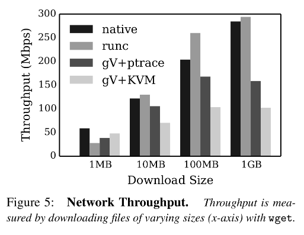
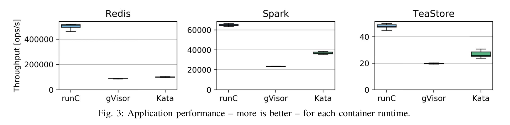

# gVisor Report

## Intro (summary, core domain)
gVisor is a container sandboxer that aims to provide highly isolated environments in which to execute less than fully trusted applications while solving a multitude of problems and inaptitudes inherent to containers and sandboxing with virtual machines.

In recognition of the gaps in isolation resulting from all containers sharing a single host operating system and all VMs sharing a hypervisor, gVisor provides a user-level implementation of Linux - the Sentry. This user-level application provides the system API to containerized applications while preventing any untrusted application from directly interacting with the host OS. Providing each sandbox with its own independent Sentry prevents untrusted applications from escaping their isolated environment through direct attacks on the shared hypervisor that are possible with traditional sandboxes. While the Sentry implements the Linux system API, the API exposed to guest applications is not identical to that of Linux. Confines are imposed on the set of system calls available to both guest applications and the Sentry itself in order to lessen the attack surface on the system. The attack suface is further diminished by relocating file system operations such as ```open()``` to a seperate module Gofer, independent and isolated from the Sentry.

In addition to its security and isolation goals, gVisor is designed with the intent to minimize start up time for containers. This is evidenced by its main deviation from traditional container sandboxing with virtual machines - rather than creating virtualized hardware for a guest kernel that guest applications will interact with, the system API provided by the Sentry is based directly off the host system API with the Sentry deferring to the host at runtime for some services.

In relation to alternatives to gVisor for isolating less than fully trusted applications for execution on a shared system such as traditional linux containers, gVisor suffers from dreadful performance. The performance hits to gVisor directly result from the exact features of the system that provide the security, isolation, and defense in depth it was built for. While the performance of gVisor lacks in relation to traditional containers, it is optimized for efficient building and destroying of containers and achieves better performance in this than container sandboxes implemented via virtualized hardware and a guest kernel.

The poor performance of gVisor in memory usage, networking, I/O and more make this system not well suited for extensive applications that execute for longer periods of time and necessitate abuntant resources. gVisor is best suited for serverless frameworks leveraging Function as a Service where applications will be run for short periods of time to provide a service, then are destroyed. The ability of gVisor to quickly build and destroy containers furthers the suitability of the system for serverless frameworks as this infrastructure necessitates multiple instantiations of these containers to execute services for many clients. Clearly minimizing construction and deconstruction time of containers maximizes the effiency and productivity of the service provider.

 Function as a Service has become more prevelent in recent years and cloud computing has grown - gVisor provides the requisite security principles and depth for the execution of untrusted guest applications from a myriad of clients in cloud computation, and is optimized for the Function as a Service model frequently implemented in modern cloud computing. As a result of these core features of gVisor, it is highly suitable and immensely valuable in cloud computing while the performance tradeoffs of these core features make gVisor a poor fit for just about any other purpose or environment.
## Modules (Sentry, Gofer, runsc, platforms)

### Gofer
#### Filesystem isolation boundaries

The Gofer module is responsible for maintaining isolation boundaries for a sandboxed container's filesystem resources. Gofer is a file proxy that runs as a separate process, isolated from the sandbox, mediating access to filesystem resources. A separate gofer instance runs for each running sandbox instance. They communicate with their respective Sentrys using the 9p protocol. The host filesystem is isolated from the sandbox using an overlay file system. This creates a temporary union mount filesystem. Thus all changes made to files are stored within the sandbox but do not affect the host file system.

Diagram of overlayfs:


The above image shows three layers. The bottom layer is the root directory of the application to be run and sandboxed by gVisor. This is called the `lowerdir` and represents the directory on the host OS. The container is mounted on `upperdir` and `merged`. `merged` is a slave mount, meaning that changes in the `lowerdir` will propagate towards `merged` but not the other way around. `merged` appears to be a full image/filesystem to the container. This is possible because any changes or additions to the filesystem are stored in `upperdir` so it still appears to have full access and control of its filesystem. This is useful because the container can make any changes and use the image at will without having to copy the entire directory into a new sandboxed filesystem.

```
type Gofer struct {
	bundleDir string   //refers to the directory containing the executable code
	ioFDs     intFlags //file descriptors used to communicate with 9p servers
	applyCaps bool     //boolean var sets whether or not capabilities are
                       //used to restrict the Gofer process. Default = true
	setUpRoot bool     //boolean var indicates whether or not an empty root should
                       //set up for the process. Default = true
	specFD   int       //file descriptor pointing to the OCI runtime spec file
	mountsFD int       //mountsFD is the file descriptor to write list of mounts
                       //after they have been resolved (direct paths, no symlinks)
}
```
Gofer is responsible for mounting this filesystem and controlling access. As shown above, there are a number of important variables tracked in the Gofer struct to help with this implementation. The runtime spec file referred to by `specFD` (example [here](https://gist.githubusercontent.com/nl5887/9b26ef8dfa5b7c1247bc09bb46175346/raw/config.json)) is used to set up all the mounts for the Gofer process required by the container. To set up its mount namespace, Gofer first turns all shared mounts into slave mounts so that changes can propagate into the shared mounts but not outside of the namespace into the host. This mount command uses the `MS_SLAVE` and `MS_REC` to accomplish this so that every mount under "/" becomes a slave. Next, the root needs to be mounted on a new `tmpfs` (temporary filesystem). `runsc` requires a `/proc` directory so the new `tmpfs` is mounted here. Under `/proc`, new directories `/proc/proc` and `/proc/root` are created to give a location for the new sandboxed root. The new `/proc/proc` is mounted with the following flags for to prevent any attempts to break out of the isolated sandbox:
- MS_RDONLY
    - don't allow process to write changes.
- MS_NOSUID
    - don't allow system to use/contain set user id files. This helps to prevent privilege escalation.
- MS_NODEV
    - don't allow access to devices or special files on the filesystem
- MS_NOEXEC
    - don't allow program execution on this filesystem

The container's source directory specified by the spec file is then mounted on the new `/proc/root`. The following flags are used:
- MS_BIND
    - Bind mount takes an existing filesystem structure and places it in a new location in the file system. This is used to place the Gofer process's directory, which is saved on the host, in an isolated location within the sandbox without copying everything over.
- MS_SLAVE
    - Turns a shared mount point into a slave mount point. This means changes can propagate from the source (the host) but changes made in the slave will not propagate to the source. Any attempts to maliciously delete files will only effect the current running sandboxed process.
- MS_REC
    - Recursively propagate these mount options to all subdirectories of the mount point.

```
// pivot_root(".", ".") makes a mount of the working directory the new
// root filesystem, so it will be moved in "/" and then the old_root
// will be moved to "/" too. The parent mount of the old_root will be
// new_root, so after umounting the old_root, we will see only
// the new_root in "/".
if err := unix.PivotRoot(".", "."); err != nil {
    return fmt.Errorf("pivot_root failed, make sure that the root mount has a parent: %v", err)
}
if err := unix.Unmount(".", unix.MNT_DETACH); err != nil {
    return fmt.Errorf("error umounting the old root file system: %v", err)
}
```
After setting up the root of the filesystem, the rest of any subsequent mounts necessary for the container's execution are mounted in the correct location under the new root. At this point, this filesystem is still in a subdirectory of `/proc` so the next step is to use `pivotRoot()` to change the root of the Gofer process's filesystem namespace to the one just created and to unmount everything outside the fs it just set up. Lastly, Gofer uses `chroot` to further isolate the processes root one more subdirectory to `/root` (because `/proc/root` just turned into `/root` in the process's namespace). Now the process sees `/` as it's own image, containing all code needed to execute, completely isolated from the host OS.

#### Process limitations
After setting up the filesystem, Gofer uses two methods of limiting what the process can do. It limits Capabilities and system calls. First it applies the minimal set of capabilities required to operate on files:
```
var caps = []string{
	"CAP_CHOWN",
	"CAP_DAC_OVERRIDE",
	"CAP_DAC_READ_SEARCH",
	"CAP_FOWNER",
	"CAP_FSETID",
	"CAP_SYS_CHROOT",
}
```
Next it uses seccomp and BPF filters to limit the system calls available to the process. Similarly to the applied capabilities, Gofer whitelists only the system calls required for execution, thus limiting the attack surface for the process.

#### Server Model
...
...


### Platforms
The platform module of gVisor is essentially the Virtual Machine Monitor for the system. The platform handles context switches and the mapping of memory as well as the intercepting of system calls from guest applications running in a virtual machine. gVisor offers two implementations of the platform model - ptrace and KVM. While both platform implementations support the same functionalities there are distinct differences and clear tradeoffs between them. The ptrace implementation offers higher portability as it can run anywhere ptrace works while KVM only functions on bare hardware or in VMs with nested virtualization enabled. The lesser constraints on deployment of ptrace provides more widespread compatability for gVisor, but at a cost. The ptrace implementation has a far higher overhead for context switches than KVM and therefore ill-suited for deployment on systems with a high rate of system call-heavy guest applications. 
Source: [gVisor platform guide](https://gvisor.dev/docs/architecture_guide/platforms/)

 This difference in context switch overhead is a result of the distinct ways in which the platform implementations handle the interception and forwarding of system calls.

 In the KVM implementation the bluepill handler runs on an infinite ```for{}```, calling ```KVM_RUN``` each loop. This handler is switched to when a context switch out of the guest application level occurs, for instance due to a system call or page fault. The handler checks the reason for the exit from guest user and directly forwards the request to the Sentry in Ring0. Once the exit reason is determined ```bluepill_handler``` invokes the appropriate bluepill functions to exit guest user and service the request or fault that caused the context switch.
 ```
 for {
        _, _, errno := unix.RawSyscall(unix.SYS_IOCTL, uintptr(c.fd), _KVM_RUN, 0) // escapes: no.
        switch errno {
        case 0: // Expected case.
```
Source: [/gvisor/pkg/sentry/platform/kvm/bluepill_unsafe.go](https://github.com/google/gvisor/blob/master/pkg/sentry/platform/kvm/bluepill_unsafe.go)

In contrast to KVM forwarding system calls to the Sentry in Ring0 through the invokation of bluepill functions, the ptrace implementation instead handles system call forwarding by making the same system call received from the guest application with PTRACE enabled in order to prevent the host kernel from actually servicing the request as Ptrace in the host kernel forwards the system call to the Sentry.
```
func (t *thread) syscall(regs *arch.Registers) (uintptr, error) {
        // Set registers.
	if err := t.setRegs(regs); err != nil {
		panic(fmt.Sprintf("ptrace set regs failed: %v", err))
	}

	for {
		// Execute the syscall instruction. The task has to stop on the
		// trap instruction which is right after the syscall
		// instruction.
		if _, _, errno := unix.RawSyscall6(unix.SYS_PTRACE, unix.PTRACE_CONT, uintptr(t.tid), 0, 0, 0, 0); errno != 0 {
			panic(fmt.Sprintf("ptrace syscall-enter failed: %v", errno))
		}
```
Source: [/gvisor/pkg/sentry/platform/ptrace/subprocess.go](https://github.com/google/gvisor/blob/master/pkg/sentry/platform/ptrace/subprocess.go)

While this maintains the same isolation and principles of defense in depth of the KVM implementation, this implementation of system call handling results in a definitively larger overhead for ptrace mode. However, this extra redirection and utilization of Ptrace in the host kernel for redirection is precisely what gives the Ptrace platform its superior compatability properties compared to KVM. Since KVM directly forwards system calls to the Sentry it cannot run in a virtual machine with nested virtualization disabled. Ptrace, however, can run inside of a VM with virtualization disabled as the system calls will simply be made to the VM hypervisor in Ptrace mode where they will then be redirected to the Sentry - this implementation eliminates the need for a hypervisor (such as KVM) executing within a hypervisor.

 In addition to handling context switches and system call forwarding, the platform is responsible for memory mappings between both guest applications and the Sentry as well as the initialization of memory reserved to and managed by the Sentry. When a Sentry is built and the guest physical memory for said Sentrys sandbox is allocated the platform makes the ```mmap()``` system call to the host kernel to fill the host address space with ```PROT_NONE``` mappings to set up the guest physical memory of the Sentry.
 ```
// physicalInit initializes physical address mappings.
func physicalInit() {
physicalRegions = computePhysicalRegions(fillAddressSpace())
}
```

```
for filled := uintptr(0); filled < required && current > 0; {
addr, _, errno := unix.RawSyscall6(
unix.SYS_MMAP,
0, // Suggested address.
current,
unix.PROT_NONE,
unix.MAP_ANONYMOUS|unix.MAP_PRIVATE|unix.MAP_NORESERVE,
0, 0)
```
Source: [/gvisor/pkg/sentry/platform/kvm/physical_map.go](https://github.com/google/gvisor/blob/master/pkg/sentry/platform/kvm/physical_map.go)

When a new sandbox is created the platform creates a new page table and computes mappings from the sandboxes guest virtual addresses to Sentrys guest physical regions. Throughout execution the platform performs translations between applications guest virtual addresses and the Sentrys guest physical addresses.
```
// PhysicalFor returns the physical address for a set of PTEs.
//
// +checkescape:all
//
//go:nosplit
func (a *allocator) PhysicalFor(ptes *pagetables.PTEs) uintptr {
```
```
func (a *allocator) LookupPTEs(physical uintptr) *pagetables.PTEs {
```
Source: [/gvisor/pkg/sentry/platform/kvm/physical_map.go](https://github.com/google/gvisor/blob/master/pkg/sentry/platform/kvm/physical_map.go)

While both KVM and Ptrace serve alongside the Sentry as the virtual machine monitor, their representations of the guest applications they manage differs. The difference in how each platform implementation represent and track data for guest applications is likely due to the added requirements of Ptrace in order to properly trace the execution and state of said guest application.

In the KVM implementation, guest applications are simply represented as a ```context``` which consists of an address space, register set, a ```machine``` and a few other bookkeeping data items. The ```machine``` data structure is where KVM maintains data on a particular VM. A switch simply consists of enabling interrupts on the virtual CPU of the machine, setting the address space as active, and loading register states.

While the Ptrace implementation of context switches also maintains similar data to KVM in a ```context``` data structure, the tracing of guest applications necessitates a subprocess to trace threads. Host threads are created depending on the number of active guest applications within a sandbox. A subprocess is a collection of traced threads, consisting of a pool of threads reserved for emulation, one reserved for system calls. The need to trace the execution of threads necessitates these subprocesses and complicates context switches in this platform. In order to switch to a given context the current runtime thread must be locked, then Ptrace must find the traced subprocess for this runtime thread and then perform the operation in this traced subprocess. 

Source: [/gvisor/pkg/sentry/platform/ptrace/ptrace.go](https://github.com/google/gvisor/blob/master/pkg/sentry/platform/ptrace/ptrace.go)

While the Ptrace implementation of the platform offers more general compatability than KVM, the necessities of tracing thread execution complicate the operations supported by the platform. In addition to the added complexity of having traced subprocesses backing guest threads, the way in which Ptrace handles system call redirection to the Sentry results in higher overhead than KVM, having the effect of decreasing the practical applications of Ptrace-mode gVisor.

### Sentry
The Sentry is the largest component of gVisor. It acts an a kernel to any application running in the sandbox. When an application running in the sandbox makes a system call, that system call is first intercepted by the Platform, then passed to the Sentry. Using a limited set of 55 host system calls, the Sentry implements 211 system calls for sandboxed applications. System calls are never passed directly from a sandboxed application to the host kernel. If possible, the Sentry will handle the call without making any system calls to the host. For system calls related to filesystem access, the Sentry makes requests Gofer using the 9P protocol. Other than system calls made to the host by Sentry, the sandbox runs exclusively in user level.

## Abstractions (and code examples showing implementation with type defs)

### Threads and Processes
Because gVisor runs its own kernel via the Sentry, a gVisor sandbox appears as a single process to the host system, regardless of how many processes are running within the sandbox. The Sentry creates a `Task` struct for each thread of execution within the sandbox. These `Task`s are dispatched as a `goroutine`, a many-to-one user-space thread model provided by the Go language and can be bundled together into a `TaskSet` to support multithreaded applications. `Task`s are scheduled by the Sentry and unknown to the host. The Sentry can create host threads as needed to support a varying volume of `Task`s running in the sandbox. A subset of the `Task` struct definition can be seen below. Similar to a `proc`, it includes fields for state, size of memory, scheduling, mutexes, filesystem context, priority, and cpu assignment. Source: [gvisor/pkg/sentry/kernel/task.go](https://github.com/google/gvisor/blob/8ad6657a22b0eaaef7d1b4a31553e826a87e9190/pkg/sentry/kernel/task.go#L58)
```go
type Task struct {
	taskNode

    //task goroutine's ID
    goid int64 `state:"nosave"`

	// runState is what the task goroutine is executing if it is not stopped.
	// If runState is nil, the task goroutine should exit or has exited.
	// runState is exclusive to the task goroutine.
	runState taskRunState

	// current scheduling state of the task goroutine.
	// gosched is protected by goschedSeq. gosched is owned by the task goroutine.
	goschedSeq sync.SeqCount `state:"nosave"`
	gosched    TaskGoroutineSchedInfo

	// p provides the mechanism by which the task runs code in userspace. The p
	// interface object is immutable.
	p platform.Context `state:"nosave"`

	// k is the Kernel that this task belongs to. The k pointer is immutable.
	k *Kernel

	// mu protects some of the following fields.
	mu sync.Mutex `state:"nosave"`

	// fsContext is the task's filesystem context.
	// fsContext is protected by mu, and is owned by the task goroutine.
	fsContext *FSContext

	// fdTable is the task's file descriptor table.
	// fdTable is protected by mu, and is owned by the task goroutine.
	fdTable *FDTable

	// ipcns is the task's IPC namespace.
	// ipcns is protected by mu. ipcns is owned by the task goroutine.
	ipcns *IPCNamespace

	// cpu is the fake cpu number returned by getcpu(2). cpu is ignored
	// entirely if Kernel.useHostCores is true.
	// cpu is accessed using atomic memory operations.
	cpu int32

	// This is used to keep track of changes made to a process' priority/niceness.
	niceness int

	// startTime is the real time at which the task started.
	// startTime is protected by mu.
	startTime ktime.Time
```

`Task` objects can be grouped together into a `TaskSet` for running multi-threaded applications within the sandbox. A `TaskSet` includes a `PIDNamespace` containing a map of `Task`s and various mechanisms for managing concurrent execution of those `Task`s. Source: [gvisor/pkg/sentry/kernel/threads.go](https://github.com/google/gvisor/blob/8ad6657a22b0eaaef7d1b4a31553e826a87e9190/pkg/sentry/kernel/threads.go#L57)
```go
type TaskSet struct {
	// mu protects all relationships between tasks and thread groups in the
	// TaskSet. (mu is approximately equivalent to Linux's tasklist_lock.)
	mu sync.RWMutex `state:"nosave"`

	// Root is the root PID namespace, in which all tasks in the TaskSet are
	// visible. The Root pointer is immutable.
	Root *PIDNamespace

	// sessions is the set of all sessions.
	sessions sessionList

	// stopCount is the number of active external stops applicable to all tasks
	// in the TaskSet (calls to TaskSet.BeginExternalStop that have not been
	// paired with a call to TaskSet.EndExternalStop). stopCount is protected
	// by mu.
	//
	// stopCount is not saved for the same reason as Task.stopCount; it is
	// always reset to zero after restore.
	stopCount int32 `state:"nosave"`

	// liveGoroutines is the number of non-exited task goroutines in the
	// TaskSet.
	//
	// liveGoroutines is not saved; it is reset as task goroutines are
	// restarted by Task.Start.
	liveGoroutines sync.WaitGroup `state:"nosave"`

	// runningGoroutines is the number of running task goroutines in the
	// TaskSet.
	//
	// runningGoroutines is not saved; its counter value is required to be zero
	// at time of save (but note that this is not necessarily the same thing as
	// sync.WaitGroup's zero value).
	runningGoroutines sync.WaitGroup `state:"nosave"`

	// aioGoroutines is the number of goroutines running async I/O
	// callbacks.
	//
	// aioGoroutines is not saved but is required to be zero at the time of
	// save.
	aioGoroutines sync.WaitGroup `state:"nosave"`
}
```

### Files
Files in the sandbox can be backed by multiple implementations. For host-native files (where a file descriptor is available), the Gofer may return a file descriptor to the Sentry via [SCM_RIGHTS](http://man7.org/linux/man-pages/man7/unix.7.html). Interactions with file descriptors use the same system calls as Linux, but the calls are implemeted in the Sentry and Gofer. Files can also be mapped into an application's address space in the sandbox using gVisor's `Mappable` interface, similar to `mmap` on Linux. Multiple sandboxes can use shared memory by mapping the same file. In addition to interacting with files on the host system, gVisor creates filesystems that exist only within the sandbox, such as a `tmpfs` at `/tmp` or `/dev/shm`. These filesystems count against the sandbox's memory allowance from the host.

gVisor filesystems are implemented similarly to Linux as well. A filesystem in gVisor consists of a tree of reference-counted `Dentry` nodes. Each `Dentry` node maintains a reference to a `DentryImpl`, or Dentry implementation. The `DentryImpl` defines how a specific `Dentry` should be managed. Unlike Linux, `Dentry` nodes in gVisor are not associated with inodes. This is due to communication with Gofer occuring through a 9P api rather than raw block devices. In addition, virtual filesystems within a sandbox would lose track of files from the host if the host were to rename an inode. Because `Dentry` nodes are handled this way, filesystems in gVisor are not responsible for deleting `Dentry` nodes with a reference count of 0. `Dentry` reference counts instead reperesent the extent to which a filesystem requires a certain `Dentry` node. The filesystem can continue to cache `Dentry` nodes with no references, or they may be discarded. The `Dentry` interface definintion can be seen below. Source: [pkg/sentry/vfs/dentry.go](https://github.com/google/gvisor/blob/20b1c3c632277bd64eac4d0442bda9695f184fc9/pkg/sentry/vfs/dentry.go#L61)
```go
type Dentry struct {
	// mu synchronizes deletion/invalidation and mounting over this Dentry.
	mu sync.Mutex `state:"nosave"`

	// dead is true if the file represented by this Dentry has been deleted (by
	// CommitDeleteDentry or CommitRenameReplaceDentry) or invalidated (by
	// InvalidateDentry). dead is protected by mu.
	dead bool

	// mounts is the number of Mounts for which this Dentry is Mount.point.
	// mounts is accessed using atomic memory operations.
	mounts uint32

	// impl is the DentryImpl associated with this Dentry. impl is immutable.
	// This should be the last field in Dentry.
	impl DentryImpl
}
```

### Memory
All memory within a gVisor sandbox is managed by the Sentry using demand-paging and backed by a single `memfs`. Address space creation is platform specific, and for some platforms, the Sentry may create addtional helper processes on the host to support additional address spaces. Like the sandbox itself, the helper processes are subject to various usage limits. Physical memory is all controlled by the host. The Sentry populates mappings from the host and allows the host to control demand-paging. The Sentry will not demand an individual page of memory. Instead, it uses memory-allocation heuristics to select regions. Generally, the Sentry can't tell whether a page is active and only provides approximate usage statistics. It can gather more accurate information if required, but only with an expensive API call. Pages are swapped and reclaimed by the host without the Sentry knowing. Providing that information to the Sentry would open the sandbox too much. The exception to this rule is when an application frees memory. The Sentry immediately releases that memory back to the host, allowing the host to most effectively manage multiplexed resources and its own memory allocation policies. There is potential for this to slow performance in the sandbox; if the Sentry needs that memory again, it must make another request to the host. Lastly, the Sentry also maintains an internal cache for storing files needed in the sandbox that can't be referenced with a host file descriptor.

## Security

### Overview
To acheive the wanted level of security and separation, gVisor deploys a few different tactics.

**The following following diagram illustrates a few key concepts for the security methodology:**
1. The redirection of system calls that are made by the sandboxed application to the sentry
2. The limited set of system calls that the Sentry actually has access to
3. The passing off to Gofer via the 9P protocol


### Syscalls
Firstly, gVisor ensures that the sandboxed application does not give system calls directly to the host. How is this done? Threads from the application are tracked, or traced, rather, by the Sentry's ptrace implementation. ptrace attaches a tracer to each necessary application thread, as well as all of the init options for the thread. So, when the application makes a system call, ptrace knows and can control its state. The baton is then handed off to the Sentry to actually process the system call request. If the call can be done completely in user-level with the implemented syscalls in the Sentry, it will do so in order to have unnecessary switches out of user-level. If there needs to be a call out to the host, then the Sentry can do so via the user-level netstack (more on that later). Lastly, if the system call is not allowed by the Sentry, then it will *not* be performed, but the application will have *no* knowledge of this capability block. 

Lets take a look at some examples.

This function attaches a ptrace to a particular thread for tracing. Additionally, options for the ptrace are initialized. 

```go

// gvisor/pkg/sentry/platform/ptrace/subprocess.go, LINE 282

// attach attaches to the thread.
func (t *thread) attach() {
	if _, _, errno := syscall.RawSyscall6(syscall.SYS_PTRACE, syscall.PTRACE_ATTACH, uintptr(t.tid), 0, 0, 0, 0); errno != 0 {
		panic(fmt.Sprintf("unable to attach: %v", errno))
	}

	// PTRACE_ATTACH sends SIGSTOP, and wakes the tracee if it was already
	// stopped from the SIGSTOP queued by CLONE_PTRACE (see inner loop of
	// newSubprocess), so we always expect to see signal-delivery-stop with
	// SIGSTOP.
	if sig := t.wait(stopped); sig != syscall.SIGSTOP {
		panic(fmt.Sprintf("wait failed: expected SIGSTOP, got %v", sig))
	}

	// Initialize options.
	t.init()
}
```
**Code Ex. 1**

This code excerpt shows the logic for checking a syscall for whether it is being tracked, needs to be run in user-level, or can be invoked.

```go
// gvisor/pkg/sentry/kernel/ptrace.go

// ptraceSyscallEnter is called immediately before entering a syscall to check
// if t should enter ptrace syscall-enter-stop.
func (t *Task) ptraceSyscallEnter() (taskRunState, bool) {
	if !t.hasTracer() {
		return nil, false
	}
	t.tg.pidns.owner.mu.RLock()
	defer t.tg.pidns.owner.mu.RUnlock()
	switch t.ptraceSyscallMode {
	case ptraceSyscallNone:
		return nil, false
	case ptraceSyscallIntercept:
		t.Debugf("Entering syscall-enter-stop from PTRACE_SYSCALL") // tracking the syscall
		t.ptraceSyscallStopLocked()
		return (*runSyscallAfterSyscallEnterStop)(nil), true
	case ptraceSyscallEmu:
		t.Debugf("Entering syscall-enter-stop from PTRACE_SYSEMU") // no host system calls for you
		t.ptraceSyscallStopLocked()
		return (*runSyscallAfterSysemuStop)(nil), true
	}
	panic(fmt.Sprintf("Unknown ptraceSyscallMode: %v", t.ptraceSyscallMode))
}

// ...

// gvisor/pkg/sentry/kernel/task_syscall.go

func (t *Task) doSyscallEnter(sysno uintptr, args arch.SyscallArguments) taskRunState {
	if next, ok := t.ptraceSyscallEnter(); ok { // this means that either a) it needs to be run in user-level, or b) it is being traced
		return next
	}
	return t.doSyscallInvoke(sysno, args) // otherwise, execute!
}
```
**Code Ex. 2**

The sentry has its own implementation of all whitelisted system calls - the sentry only is allowed a subset of all possible system calls. 51 to be exact, which can all be found in the gvisor/pkg/sentry/syscalls/linux directory. This reduced set of system calls allows for a smaller attack surface. The fewer system calls there are, the fewer possibilities there are for an attacker to pass malicious arguments or perform other exploits. This is also assisted by the many layers that are present from when the contained application makes the call, to when the call is invoked, if ever. All of this seems expensive though, doesn't it? Well it is. gVisor even acknowledges in its documentation that if your contained application needs to make many system calls, there will be a significant performance hit. This is due to the necessity of tracing the system calls and applications for security - without that, the security model just crumbles.

And here is an example of a 'whitelisted' system call in the Sentry. It is an individual implementation of linux's pipe(2) system call.

```go
// pipe2 implements the actual system call with flags.
func pipe2(t *kernel.Task, addr hostarch.Addr, flags uint) (uintptr, error) {
	if flags&^(linux.O_NONBLOCK|linux.O_CLOEXEC) != 0 {
		return 0, syserror.EINVAL
	}
	r, w := pipe.NewConnectedPipe(t, pipe.DefaultPipeSize)

	r.SetFlags(linuxToFlags(flags).Settable())
	defer r.DecRef(t)

	w.SetFlags(linuxToFlags(flags).Settable())
	defer w.DecRef(t)

	fds, err := t.NewFDs(0, []*fs.File{r, w}, kernel.FDFlags{
		CloseOnExec: flags&linux.O_CLOEXEC != 0,
	})
	if err != nil {
		return 0, err
	}

	if _, err := primitive.CopyInt32SliceOut(t, addr, fds); err != nil {
		for _, fd := range fds {
			if file, _ := t.FDTable().Remove(t, fd); file != nil {
				file.DecRef(t)
			}
		}
		return 0, err
	}
	return 0, nil
}
```
**Code Ex. 3**

### User-level Netstack


**Fig. 2**

### Gopher

## Performance / Optimizations

In looking at the performance of gVisor, it is important to look at five main benchmarks:

1. Container startup/tear down
2. System call throughput
3. Memory allocation
4. File system access
5. Networking

An important point that must be discussed before comparing the performance of gVisor is which platform is used to handle system calls made to the host. The first is *Kernel Virtual Mode (KVM)* which allows Linux itself to act as hypervisor by providing a loadable kernel module. The other option is *ptrace* which allows a process to intercept a system call being called.
It should be noted that ptrace [suffers from the highest structural costs by far](https://gvisor.dev/docs/architecture_guide/performance/).

### The True Cost of Contanerization - Ethan G. Young, et al.

A [paper written by Ethan G. Young, et al. at the Univeristy of Wisconsin](research/performance-res/true-cost-containing-young.pdf) ran experiments running runc against runsc in both ptrace and KVM mode. Their study examined the two systems in the five different benchmarks discussed previously.

#### Container Startup/Tear Down


The results suggest that the differences between running gVisor with ptrace versus KVM for container initialization is neglible. In the context of runc however, there is about a 13% decrease in performance between runc and runsc. Although Google claims that gVisor is designed use in machines with many containers, these results suggest that runc still has an edge here.

#### System Call Throughput

In order to test the system call performace of gVisor, three versions of the same `gettimeofday` syscall was implemented: one invoking just the Sentry, one invoking the host OS, and the third invoking the use of Gofer. It is also important to note that gVisor was tested in both ptrace and KVM mode.


The implication here is that even in gVisor's best case (running in KVM and only calling Sentry), the performance is still 2.8x slower. It is also clear from the results that calling to Gofer suffers from the worst performance. Compared to runc, Gofer runs between 156x and 175x slower depeding on the platform.

#### Memory Allocation


The key takeaway from these results is that gVisor achieves just 40% the allocation rate of native systems.

#### File System Access


As previously discussed, Gofer suffers from the largest performance tradeoff. This is even more evident in the results of using Gofer to access files. Opening and closing files on Gofer's external tmpfs is 216x slower than native compared to just 12x slower for access to Sentry's internal tmpfs.

#### Networking

gVisor uses its own network stack in order to safely and securely handle all networking down. This is one area in particular that [Google claims "is improving quickly"](https://gvisor.dev/docs/architecture_guide/performance/#network).
To test networking throughput, `wget` was called for file sizes of various sizes.



The results show that gVisor may handle small downloads well, relative to native performance, but as file sizes increase, gVisor fails to scale well.

### Security-Performance Trade-offs of Kubernetes Container Runtimes - Viktorsson, et al.

Another [study](research/performance-res/security-performace-tradeoffs-viktorsson.pdf) attempted to measure the performace of gVisor in more real world applications rather. All tests run in this study used the pTrace platform.
Three different application's total throughput were tested:

1. **TeaStore:**

- TeaStore is a microservice benchmark that emulates a webstore and provides features that include browising, selecting, and ordering tea. The throughput is measured as the average requests per second throughput for eight available API operations.

2. **Redis:**
- Redis is an in memory data-store featuring data structures such as hashes, lists, sets, and more. The throughput is measure using requests per second of the O(1) GET operation.

3. **Spark:**
 - Spark is a distributed general purpose computing framework for big data processing. The throughput is measured as the average number of primes found per second when finding all prime numbers in the first million integers.



In testing TeaStore and Spark, gVisor has about 40-60% the throughput of runc. For Redis, it suffers dramtically at just 20% the throughput of runc. The poor performace in Redis is likely due to the fact that it is neither CPU nor memory demanding and thus its performance is based solely on the GET request to in-memory data. This suggests that Redis performance is largely based on networking throughput.

### A Deeper Look into Memory Allocation in gVisor

gVisor's memory allocation system involves a two-level physical to virtual mapping where first Sentry requests memory chunks of 16MB increments from the host OS. Then, when an application running in the sandbox requests memory (using `mmap()`), Sentry allocates a portion of the 16MB chunk for the application.

#### From Host to Sentry

First we'll look at the sequence of code that allows Sentry to get memory from the host OS. `Allocate()` returns a `MemoryFile` which is a mapping of a chunk of memory from the host. This is the struct that Sentry will later use to find available pages of memory to allocate to an application.

```go
// Line 381 of pgalloc.go
// Allocate returns a range of initially-zeroed pages of the given length with
// the given accounting kind and a single reference held by the caller. When
// the last reference on an allocated page is released, ownership of the page
// is returned to the MemoryFile, allowing it to be returned by a future call
// to Allocate.
//
// Preconditions: length must be page-aligned and non-zero.
func (f *MemoryFile) Allocate(length uint64, kind usage.MemoryKind) (memmap.FileRange, error) {

    // ...

    // Align hugepage-and-larger allocations on hugepage boundaries to try
    // to take advantage of hugetmpfs.
    alignment := uint64(hostarch.PageSize)
    if length >= hostarch.HugePageSize {
        alignment = hostarch.HugePageSize
    }

    // Find a range in the underlying file.
    fr, ok := findAvailableRange(&f.usage, f.fileSize, length, alignment)
    if !ok {
        return memmap.FileRange{}, syserror.ENOMEM
    }

    // ...

    if f.opts.ManualZeroing {
        if err := f.manuallyZero(fr); err != nil {
            return memmap.FileRange{}, err
        }
    }
    // Mark selected pages as in use.
    if !f.usage.Add(fr, usageInfo{
        kind: kind,
        refs: 1,
    }) {
        panic(fmt.Sprintf("allocating %v: failed to insert into usage set:\n%v", fr, &f.usage))
    }

    return fr, nil
}
```

#### From Sentry to Application

When an application running in gVisor calls `mmap()`, first the `Mmap()` syscall is invoked:

``` go
// Line 42 of sys_mmap.go
func Mmap(t *kernel.Task, args arch.SyscallArguments) (uintptr, *kernel.SyscallControl, error)
```
It is important to note the two arguments to the function: `t *kernel.Task` and `args arch.SyscallArguments`. 
A `Task` represents an execution thread in an un-trusted app. This includes thread-specific state such as registers.
`SyscallArguments` include the length of the memory region requested and a pointer to the memory. These arguments will later be stored in an `MMapOpts` object inside `MMap()`.

From here, `MMap()` is invoked in Sentry.

``` go
// Line 75 of syscalls.go
func (mm *MemoryManager) MMap(ctx context.Context, opts memmap.MMapOpts) (hostarch.Addr, error) {
```
This function takes in `Context`, which represents the thread of execution, as well as the `MMapOpts` that was created in the previous function.

Inside of `MMap()`, `createVMALocked` is called on line 122 which is where a new VMA is allocated.

``` go
// Line 33 of vma.go
func (mm *MemoryManager) createVMALocked(ctx context.Context, opts memmap.MMapOpts) (vmaIterator, hostarch.AddrRange, error) {

    // ...
    // Line 38

    // Find a usable range.
    addr, err := mm.findAvailableLocked(opts.Length, findAvailableOpts{
        Addr:     opts.Addr,
        Fixed:    opts.Fixed,
        Unmap:    opts.Unmap,
        Map32Bit: opts.Map32Bit,
    })

    // ...
    // Line 55    

    // Check against RLIMIT_AS.
    newUsageAS := mm.usageAS + opts.Length
    if opts.Unmap {
        newUsageAS -= uint64(mm.vmas.SpanRange(ar))
    }
    if limitAS := limits.FromContext(ctx).Get(limits.AS).Cur; newUsageAS > limitAS {
        return vmaIterator{}, hostarch.AddrRange{}, syserror.ENOMEM
    }

    if opts.MLockMode != memmap.MLockNone {
        // Check against RLIMIT_MEMLOCK.
        if creds := auth.CredentialsFromContext(ctx); !creds.HasCapabilityIn(linux.CAP_IPC_LOCK, creds.UserNamespace.Root()) {
            mlockLimit := limits.FromContext(ctx).Get(limits.MemoryLocked).Cur
            if mlockLimit == 0 {
                return vmaIterator{}, hostarch.AddrRange{}, syserror.EPERM
            }
            newLockedAS := mm.lockedAS + opts.Length
            if opts.Unmap {
                newLockedAS -= mm.mlockedBytesRangeLocked(ar)
            }
            if newLockedAS > mlockLimit {
                return vmaIterator{}, hostarch.AddrRange{}, syserror.EAGAIN
            }
        }
    }

    // ...
}
```

`createVMALocked()` finds a mappable region of memory to allocate. One of the important check is to see if the `Context` has access to this region and can allocate more memory.

#### Tradeoffs of gVisor's Memory Allocation
Due to the double level page table system, applications requesting small pieces of memory (relative to the size requested from the host by Sentry) suffer in performace. As the size of the memory requested by an application increases, the performance increases. However, it should be noted that memory allocation of any size is not very fast in gvisor relative native Linux containers.

### Blending Containers and Virtual Machines: A Study of Firecracker and gVisor - Anjali, et al.

This next [paper](research/performance-res/blending-containers-vms-anjali.pdf) studied memory performance differences between native Linux with no isolation, Linux containers, and gVisor (using KVM-mode).

Because of gVisors two level page tables, Sentry requests memory from the host in 16MB chunks in order to reduce the number of `mmap()` calls to the host. When 1GB of memory is requested by the host application, there will be exactly 64 `mmap()` calls to the host.


The test performed called `mmap()` with varying sizes ranging from 4KB to 1MB for a total of 1GB of memory. The results show that when allocating 4KB pieces gVisor performs about 16x slower than host Linux and Linux containers. When allocating 64KB chunks, the gap lessens by almost half and gVisor is only 8-10x slower.
In the case of comparing to gVisor, the difference between host Linux and Linux containers is negligble.
This is an important implication as there is a trend between gVisor's memory allocation performace and the size of the request: as size increases, gVisor's gap to Linux grows smaller. This is likely due to the two-level page table system implemented in gVisor. As an application's memory request grows closer to 16MB, less work in Sentry is being performed to further split that chunk into smaller pieces for the applications running in the sandbox.

### Performace Conclusion

From the studies presented, it is clear that if performance is a concern, gVisor is not a good fit for applications requiring heacy use of syscalls, heavy uses of memory, heavy uses of networking, nor heavy uses of file system accesses. gVisor instead is a good fit for lightweight, serveless applications. Because gVisor does not suffer a significant performance loss in building, deploying, and destroying containers compared to standard Linux containers, secure containers can be quickly created for lightweight applications as needed.

## Subjective Opinions
- Sam
- Jake
- Jack
- Will
gVisor is a very secure container implementation with many layers of defense in depth, and it shows (preventing security vulnerabilities that docker, for example, was subsceptible to). However, there is a consequential and significant performance hit. I don't necessarily think this is a nail in the coffin, though. To acheive the level of security that gVisor was intending to reach, there are necessary tradeoffs that had to be made - like tracing all system calls and redirecting to be intercepted. That simply cannot be cheap no matter which way you look at it. But that is not the point of gVisor. The core component is security, and it does it very well. 
- Jon
The performance hits gVisor takes as an effect of the features of its security oriented design seem so significant that gVisor would be entirely useless in any setting other than a serverless framework operating on the principle of functions as a service. This is exactly what it was designed for, so this isn’t a huge insult, but it certainly is not a very versatile system and modifying it to be of use in other environments does not seem like a feasible task to undertake. The security principles of the system are exceptional and it is clear how gVisor would be far better for fully isolating applications from each other than traditional container sandboxing. For its intended purpose gVisor provides much needed security and isolation, and the performance tradeoffs with security are worth it. When used in the type of systems it was intended for, the improved construction and deconstruction time of containers should have a larger impact on performance than the issues with performance gVisor faces at runtime - in all, gVisor adequately meets its goals and successfully tackles the problems it tries to solve with container sandboxing with acceptable tradeoffs, making it a very good system for serverless framework cloud computing.
