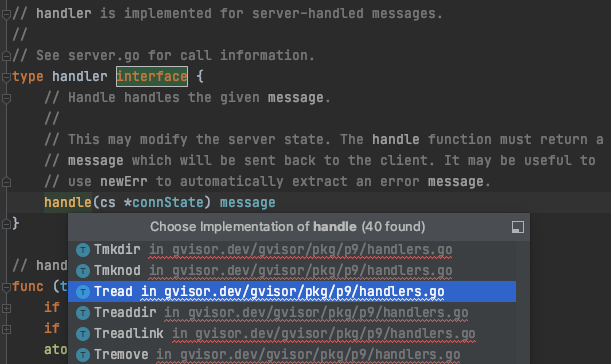

## Jack Umina


## Jake Cannizzaro
#### Isolation boundaries, filesystem resources, & the Gofer module:
Gofer is a file proxy that runs as a separate process, isolated from the sandbox, giving access to file system resources. A separate gofer instance runs for each running sandbox instance. They communicate with their respective sentrys using the 9p protocol.
The host filesystem is isolated from the sandbox using an overlay file system. This creates a temporary union mount filesystem. Thus all changes made to files are stored within the sandbox but do not affect the host file system.
Instructions to use this overlay filesystem can be found [here](https://gvisor.dev/docs/user_guide/filesystem/):
To use the tmpfs overlay, add the following runtimeArgs to your Docker configuration (/etc/docker/daemon.json) and restart the Docker daemon:
```
{
    "runtimes": {
        "runsc": {
            "path": "/usr/local/bin/runsc",
            "runtimeArgs": [
                "--overlay"
            ]
       }
    }
}
```
This will allow the Gofer process to use the fs outside the root of the sandbox but not the other way around. If one needs more than one instance to have access to the directory, a shared command can be used to allow access from outside the container. This is done by adding `"--file-access=shared"` to the `runtimeArgs` section shown above.

Diagram of overlayfs:


The above image shows three layers. The bottom layer is called the `lowerdir` and represents the base image the container will mount. The `upperdir` holds the container's bundled file directory with all of its code. The container is mounted on `merged` which is the overlay layer. `merged` is a slave mount, meaning that changes in the `lowerdir` will propagate towards `merged` but not the other way around. `merged` appears to be a full image/filesystem with all of its own code to the container. The `lowerdir` layer is readonly and changes here will not change the actualy base image stored on the host. Changing or adding files to the `lowerdir` will create a copy of the file in the `upperdir` and changes are stored there. Deletions are implemented with whiteout files/directories that are transparently stored in the overlay layer. Changes to the `upperdir` can take place as normal. This copy-on-write feature is useful because the container can make any changes and use the image at will without having to copy the entire directory into a new sandboxed filesystem (See this [paper](https://www.usenix.org/system/files/hotstorage19-paper-koller.pdf) discussing overlay filesystems in a container context).


#### Diving in to the [code](https://github.com/google/gvisor):
##### Security
Starting at [runsc/cmd/gofer.go](https://github.com/google/gvisor/blob/master/runsc/cmd/gofer.go) ---
Gofer uses golang [subcommands](https://github.com/google/subcommands) so that when the program is run, additional arguments can be set to set parameters within the code. These arguments populate the `Gofer` struct.
```
// Gofer implements subcommands.Command for the "gofer" command, which starts a
// filesystem gofer.  This command should not be called directly.
type Gofer struct {
	bundleDir string   //refers to the directory containing the executable code
	ioFDs     intFlags //file descriptors used to communicate with 9p servers
	applyCaps bool     //boolean var sets whether or not capabilities are
                       //used to restrict the Gofer process. Default = true
	setUpRoot bool     //boolean var indicates whether or not an empty root should
                       //set up for the process. Default = true
	specFD   int       //file descriptor pointing to the OCI runtime spec file
	mountsFD int       //mountsFD is the file descriptor to write list of mounts
                       //after they have been resolved (direct paths, no symlinks)
}
```
The main logic of this program begins with `Execute()`. It begins by populating two variables, `conf`, and `spec`. `conf` is an instance of a [config](https://pkg.go.dev/gvisor.dev/gvisor/runsc/config#Config) which holds environment configuration information that isn't a part of the runtime spec. The runtime spec (example [here](https://gist.githubusercontent.com/nl5887/9b26ef8dfa5b7c1247bc09bb46175346/raw/config.json)) is populated into `spec` by calling `specutils.ReadSpecFromFile()` on the file obtained with the `specFD` field of the `Gofer` struct. This method parses through the json spec file and updates the `conf` variable and then returns `spec`. This is important as these will be used throughout the rest of the program.

Setting up the root filesystem:
`func setupRootFS(spec *specs.Spec, conf *config.Config) error {`
This function first turns all shared mounts into slave mounts so that changes can propagate into the shared mounts but not outside of the namespace into the host. This mount command uses the `MS_SLAVE` and `MS_REC` to accomplish this so that every mount under "/" becomes a slave. Next, the root needs to be mounted on a new `tmpfs` filesystem. `runsc` requires a `/proc` directory so the `tmpfs` is mounted here. Under `/proc`, new directories `/proc/proc` and `/proc/root` are created to give a location for the sandbox root. The new `/proc/proc` is mounted with the following flags for to prevent any attempts to break out of the isolated sandbox:
- MS_RDONLY
    - don't allow process to write changes.
- MS_NOSUID
    - don't allow system to use/contain set user id files. This helps to prevent privilege escalation.
- MS_NODEV
    - don't allow access to devices or special files on the filesystem
- MS_NOEXEC
    - don't allow program execution on this filesystem

The Gofer process's root is then mounted on the new `/proc/root` with the source directory specified by the spec file. The following flags are used:
- MS_BIND
    - Bind mount takes an existing filesystem structure and places it in a new location in the file system. This is used to place the Gofer process's directory, which is saved on the host, in an isolated location within the sandbox without copying everything over.
- MS_SLAVE
    - Turns a shared mount point into a slave mount point. This means changes can propagate from the source (the host) but changes made in the slave will not propagate to the source. Any attempts to maliciously delete files will only effect the current running sandboxed process.
- MS_REC
    - Recursively propagate these mount options to all subdirectories of the mount point.

Once the initial filesystem has been created, `setupMounts()` and `resolveSymlinks()` are called to bind all mounts specified in the spec file as well as changing any relative paths and symlinks so that they point to their new locations within the sandbox. Depending on the spec, the new root filesystem can be remounted read only for extra protection. At this point the filesystem is set up but still in some subdirectory of the process's view of the namespace. `pivotRoot()` is called to actually make `/proc` the process's root directory. This essentially changes the process's view of the filesystem its mounted on. After this, the process is on the way to being sandboxed and cannot access the host filesystem.

After setting up the process's file system, process capabilities are set with goferCaps:
```
var caps = []string{
	"CAP_CHOWN",
	"CAP_DAC_OVERRIDE",
	"CAP_DAC_READ_SEARCH",
	"CAP_FOWNER",
	"CAP_FSETID",
	"CAP_SYS_CHROOT",
}

// goferCaps is the minimal set of capabilities needed by the Gofer to operate
// on files.
var goferCaps = &specs.LinuxCapabilities{
	Bounding:  caps,
	Effective: caps,
	Permitted: caps,
}
```
Limiting the process's capabilities to this set bounds the permitted set of capabilities for the process to prevent it from having more privilege than needed. See the [capabilities manual page](https://man7.org/linux/man-pages/man7/capabilities.7.html) to to see just how many capabilities there are in linux and why it makes sense to limit them in this way.

The next part of the Gofer sandboxing involves `chroot`ing the process to `/root`. Note after calling `pivot_root()`, `/proc` became `/` in the process's filesystem. Now the process is `chroot`ed to what was originally created as `/proc/root`, which now in the processes view is the new `/`. This adds an extra layer of isolation by further jailing the process one subdirectory down. The following section will go over setting up the 9p protocol used to serve files to the container. The last layer of protection added to this Gofer process is added after that setup. That is installing seccomp filters, utilizing BPF instructions, in order to whitelist and limit the allowed system calls allowed by the process.

##### 9p / Server Model
Gofer acts as the file server for the running gVisor containers. This means each container is a client that must request files from it. After sandboxing the Gofer process, a list of p9 attachers is allocated. Then, beginning with `/`, an attach point is created for every mount point specified in the spec file. This is done using the `fsgofer` package, which implements Plan 9 file giving access. After installing the seccomp filters, `runServers()` is called to, you guessed it, run the servers. As well as holding the mount points necessary for the container, the specfile holds a list of `ioFD`s which are file descriptors used to connect to 9P servers. Iterating through the list of associated `ioFD`s and attachment points, a goroutine (concurrently executed functions) is started to  is create a new socket for each `ioFD`, and a new p9 server for each attachment point. `Handle()` is then called on each attachment point, passing the associated socket. `Handle()` is located within `gvisor/pkg/p9/server.go`. Through a few levels of indirection within the same file, `Handle()` begins the process of infinitely looping until further requests aren't needed, some error occurs, or an error in another goroutine occurs, which signals a shutdown/exit signal for the thread.
```
func runServers(ats []p9.Attacher, ioFDs []int) {
	// Run the loops and wait for all to exit.
	var wg sync.WaitGroup
	for i, ioFD := range ioFDs {
		wg.Add(1)
		go func(ioFD int, at p9.Attacher) {
			socket, err := unet.NewSocket(ioFD)
			if err != nil {
				Fatalf("creating server on FD %d: %v", ioFD, err)
			}
			s := p9.NewServer(at)
			if err := s.Handle(socket); err != nil {
				Fatalf("P9 server returned error. Gofer is shutting down. FD: %d, err: %v", ioFD, err)
			}
			wg.Done()
		}(ioFD, ats[i])
	}
	wg.Wait()
	log.Infof("All 9P servers exited.")
}
```

As shown above, to begin, the gofer creates one goroutine (to begin with, more can be added as necessary) per client connection and calls `Handle()`. `Handle()` creates a connection state for the given connection and calls `handleRequests()`. This method is a simple wrapper that just infinitely calls `handleRequest()` until an error is thrown or the goroutine receives the shutdown signal. `handleRequest()` "handles" the main logic of dealing with client connections.

Before moving on to handling the connections, a brief aside is necessary to understand the threading model of the Gofer server. [Goroutines](https://tour.golang.org/concurrency/1) are lightweight threads managed by the Go runtime. Within gVisor's [resource model documentation](https://gvisor.dev/docs/architecture_guide/resources/), it is explained that threading is a lightweight "green thread". See this [paper](https://citeseerx.ist.psu.edu/viewdoc/download?doi=10.1.1.8.9238&rep=rep1&type=pdf) comparing Linux Threads to Green Threads. This paper explains green threads in the Java runtime but the concept applies here as well for the Go runtime (Go's resource model itself links a wikipedia article which sources a paper talking about Java green threads). Green threads are a userspace thread implementation that don't need a backing kernel thread. In this model, green threads are mapped to a single task and can be managed with little overhead. This is in contrast to the system calls required with linux threads. Thread activation also takes less overhead because Linux threads must create a corresponding execution entity within the kernel. When latency is important for an application, it is recommended for threads to be created at initialization rather than on demand.

In Gofer, the goroutines used to handle client requests represent a many-to-one model where many userspace goroutines correspond to one actual OS thread. They can be spun up as necessary depending on the demand of the client connection to the sentry. Back to `handleRequest()` in `gvisor/pkg/p9/server.go`. This method has a critical section as letting multiple threads attempt to modify the same structures in the given connection state could cause unexpected behavior and errors. Therefore, the first thing a goroutine does when entering this function is attempt to take the mutex for the connections state:
```
atomic.AddInt32(&cs.recvIdle, 1)
cs.recvMu.Lock()
atomic.AddInt32(&cs.recvIdle, -1)
```
The atomic add instructions on either side of the lock let all goroutines associated with the given connection keep track of the number of idle threads waiting to enter the critical section. The `.Lock()` method above goes to `Lock()` in `gvisor/pkg/sync/mutex_unsafe.go` which then calls `Lock()` in `/usr/local/go/src/sync/mutex.go`:
```
// Lock locks m.
// If the lock is already in use, the calling goroutine
// blocks until the mutex is available.
func (m *Mutex) Lock() {
	// Fast path: grab unlocked mutex.
	if atomic.CompareAndSwapInt32(&m.state, 0, mutexLocked) {
		if race.Enabled {
			race.Acquire(unsafe.Pointer(m))
		}
		return
	}
	// Slow path (outlined so that the fast path can be inlined)
	m.lockSlow()
}
```
You can see an interesting optimization here where the fast path assumes the mutex is free and inlines that logic in the function. If the mutex is taken, `lockSlow()` is implemented in a different function because the blocking mechanism takes more logic so it is slow pathed.

Back to `server.go` - `handleRequest()`. The next step is to recieve the message from the client:
```
// Receive a message.
tag, m, err := recv(cs.conn, messageSize, msgRegistry.get)
if errSocket, ok := err.(ErrSocket); ok {
    // Connection problem; stop serving.
    log.Debugf("p9.recv: %v", errSocket.error)
    cs.recvShutdown = true
    cs.recvMu.Unlock()
    return false
}
```
`recv()` in `gvisor/pkg/p9/transport.go`:
```
// recv decodes a message from the socket.
// This is done in two parts, and is thus not safe for multiple callers.
// On a socket error, the special error type ErrSocket is returned.
// The tag value NoTag will always be returned if err is non-nil.
func recv(s *unet.Socket, msize uint32, lookup lookupTagAndType) (Tag, message, error) {
```
As you can see in the comments above the method, this method is unsafe for multiple callers, hence the mutex used above. This method then calls `ReadVec()` in `gvisor/pkg/unet/unet_unsafe.go`. This method reads into pre-allocated buffers. Another interesting optimization is found in this method. This is the main read loop of the method:
```
for {
    var e unix.Errno

    // Try a non-blocking recv first, so we don't give up the go runtime M.
    n, _, e = unix.RawSyscall(unix.SYS_RECVMSG, uintptr(fd), uintptr(unsafe.Pointer(&msg)), unix.MSG_DONTWAIT|unix.MSG_TRUNC)
    if e == 0 {
        break
    }
    if e == unix.EINTR {
        continue
    }
    if !r.blocking {
        r.socket.gate.Leave()
        return 0, e
    }
    if e != unix.EAGAIN && e != unix.EWOULDBLOCK {
        r.socket.gate.Leave()
        return 0, e
    }

    // Wait for the socket to become readable.
    err := r.socket.wait(false)
    if err == errClosing {
        err = unix.EBADF
    }
    if err != nil {
        r.socket.gate.Leave()
        return 0, err
    }
}
```
Consider two cases, a busy stream over the connection and a sparse stream of data. This loop first attempts a nonblocking receive to handle the client request immediately. On a busy stream of data, this will give instant responses to the client without any blocking necessary. However, if the client socket has nothing incomming, this goroutine will simply wait on the socket to have data. In this way, the gofer server implements a both non-blocking and blocking implementation to handle requests as soon as possible. When the goroutine ends up back in `handleRequest()`, assuming no errors...
```
// Ensure that another goroutine is available to receive from cs.conn.
if atomic.LoadInt32(&cs.recvIdle) == 0 {
    go cs.handleRequests() // S/R-SAFE: Irrelevant.
}
cs.recvMu.Unlock()
```
... the goroutine spawns another goroutine (on the same connection state `cs`) to handle the next request from the client as it finishes handling the current one and sending a response. That if statement checks to see if another goroutine is already waiting to take the mutex above, and if so, doesn't need to spawn a new one because as soon as this one unlocks and releases the mutex, that one will come into the critical section to handle the next response. Assuming the goroutines can quickly process and send responses to the clients, this thread pool will never grow too large and will simply reuse the same small set of goroutines per connection.

To actually handle the request and perform some filesystem operation, `cs.handle()` is called with the received message. The action depends on the message, so the message handler function implements the handler interface shown below to carry out the appropriate action. Some different options are also shown below.



An example, Tread, which is used for read requests:
```
// line 683 in /gvisor/pkg/p9/handlers.go
// handle implements handler.handle.
func (t *Tread) handle(cs *connState) message {
	ref, ok := cs.LookupFID(t.FID)
	if !ok {
		return newErr(unix.EBADF)
	}
	defer ref.DecRef()

	// Constrain the size of the read buffer.
	if int(t.Count) > int(maximumLength) {
		return newErr(unix.ENOBUFS)
	}

	var (
		data = make([]byte, t.Count)
		n    int
	)
	if err := ref.safelyRead(func() (err error) {
		// Has it been opened already?
		if !ref.opened {
			return unix.EINVAL
		}

		// Can it be read? Check permissions.
		if ref.openFlags&OpenFlagsModeMask == WriteOnly {
			return unix.EPERM
		}

		n, err = ref.file.ReadAt(data, t.Offset)
		return err
	}); err != nil && err != io.EOF {
		return newErr(err)
	}

	return &Rread{Data: data[:n]}
}
```
This method returns the data requested from the filesystem. A write request would return the number of bytes successfully written. Whatever message is returned from the respective `handle()` implementation is then sent back to the client:
```
//line 571 in gvisor/pkg/p9/server.go
// Handle the message.
r := cs.handle(m)
...
// Send back the result.
cs.sendMu.Lock()
err = send(cs.conn, tag, r)
cs.sendMu.Unlock()
```


## Jon Terry
#### Platform:
- KVM:
    - handles setting up page tables for VMs, switching between guest user and guest OS
        - machine.go's SwitchToUser() in /pkg/ring0 calls entersyscall() followed by bluepill(c) where c is the current vCPU
            - bluepill.go:

            ```
            // bluepill enters guest mode.
            func bluepill(*vCPU)
            ```

            - bluepill_unsafe.go:
            ```
            func bluepillHandler(context unsafe.Pointer) {
                // Sanitize the registers; interrupts must always be disabled.
                c := bluepillArchEnter(bluepillArchContext(context))

                // Mark this as guest mode.
                switch atomic.SwapUint32(&c.state, vCPUGuest|vCPUUser) {
            ```
            - this contrasts with the ptrace platform since KVM directly handles context switches from system calls. In ptrace the call made to the host OS in ptrace mode and then ptrace redirects it
    - handles allocation and mapping of guest physical memory
        - physicalInit() (/platform/kvm/physical_map.go) calls fillAddressSpace which "fills the host address space with PROT_NONE mappings until we have a host address space size that is less than or equal to the physical address space." and computes guest physical regions of memory.

            ```
            // physicalInit initializes physical address mappings.
            func physicalInit() {
                physicalRegions = computePhysicalRegions(fillAddressSpace())
            }
            ```

            ```
            for filled := uintptr(0); filled < required && current > 0; {
            addr, _, errno := unix.RawSyscall6(
                unix.SYS_MMAP,
                0, // Suggested address.
                current,
                unix.PROT_NONE,
                unix.MAP_ANONYMOUS|unix.MAP_PRIVATE|unix.MAP_NORESERVE,
                0, 0)
            ```
        - VM sets up page tables for guest virtual to guest physical mappings based off the physical regions computed from the host virtual memory
        ```
        // Apply the physical mappings. Note that these mappings may point to
	    // guest physical addresses that are not actually available. These
	    // physical pages are mapped on demand, see kernel_unsafe.go.
	    applyPhysicalRegions(func(pr physicalRegion) bool {
        ```
    - handles creation of VMs and memory allocation for them
        - fills host address space with PROT_NONE mappings up to the size of the guest physical address space
    - handles page faults in VMs
        - if bluepillHandler gets a page fault it passes in the ptr to the VM, the physical address of the fault, and physicalRegions which is a list of available physical memory regions (guest physical). The fault handler first gets the virstual and physical addresses for the fault address range, then gets the next available memory slot for the VM and creates a new user memory region with the new slot, guest physical address and guest virtual address and makes a system call to set the new region as user memory
     ```
    func (m *machine) setMemoryRegion(slot int, physical, length, virtual uintptr, flags uint32) unix.Errno {
        userRegion := userMemoryRegion{
            slot:          uint32(slot),
            flags:         uint32(flags),
            guestPhysAddr: uint64(physical),
            memorySize:    uint64(length),
            userspaceAddr: uint64(virtual),
        }

        // Set the region.
        _, _, errno := unix.RawSyscall(
            unix.SYS_IOCTL,
            uintptr(m.fd),
            _KVM_SET_USER_MEMORY_REGION,
            uintptr(unsafe.Pointer(&userRegion)))
        return errno
    }
     ```
    - system calls caught by KVM, calls ring0.WriteFS(FS_base_register)
        -ring0 contains defintions for exceptions stubs, vector maps for exception handlers, redirects for syscalls and exceptions, page table handling, and context switches
        ```
        func (c *CPU) SwitchToUser(switchOpts SwitchOpts) (vector Vector) {
			userCR3 := switchOpts.PageTables.CR3(!switchOpts.Flush, switchOpts.UserPCID)
			c.kernelCR3 = uintptr(c.kernel.PageTables.CR3(true, switchOpts.KernelPCID))
        ```
- ptrace:
    - When new address space created, creates child process with single thread which is traced by a single goroutine
    - calling switch on context:
        - locks runtime thread
        - looks up traced subprocess thread for current runtime thread, creates new stopped thread in subprocess if none exists, subprocess traced by current thread.
        - requested operation is performed in traced subprocess
    - when subprocesses are released, they're unmappped and released to globalPool rather than being killed
        - can't kill them on call to release() because the thread can't exit until all tracers have been notified and the tracers are random runtime threads
        - global pool also has a master subprocess utilized for installing seccomp filters
        - when new subprocess requested, either one from the globalPool can be returned or a new one can be created and returned if there aren't any in globalPool to return
    ```
            func newSubprocess(create func() (*thread, error)) (*subprocess, error) {
        // See Release.
        globalPool.mu.Lock()
        if len(globalPool.available) > 0 {
            sp := globalPool.available[len(globalPool.available)-1]
            globalPool.available = globalPool.available[:len(globalPool.available)-1]
            globalPool.mu.Unlock()
            return sp, nil
        }
        globalPool.mu.Unlock()

        // The following goroutine is responsible for creating the first traced
        // thread, and responding to requests to make additional threads in the
        // traced process. The process will be killed and reaped when the
        // request channel is closed, which happens in Release below.
        errChan := make(chan error)
        requests := make(chan chan *thread)
    ```

    - subprocess is a collection of threads being traced
        - has sysemuThreads pool reserved for emulation, syscallThreads pool resserved for syscalls, a mutex, set of contexts who's pointer might be to this subprocess
            -contexts contain:
                -signal and interrupt info
                - pointer to the subprocess that was executing when fault occured (lastFaultSP)
                - faulting address
                - faulting instruction pointer
    - syscall() takes syscall number and args, creates new subprocess (or gets one from globalPool), sets up registers and calls thread.syscall() which executes the system call in a traced context (passes ptrace arguments to unix system call), then restores the registers
        - actually goes to host kernel, ptrace in kernel then forwards the syscalls to the sentry


## Sam Frey
#### [What is gVisor](https://gvisor.dev/docs/)
- runsc executable
    - implements [Open Container Initiative (OCI)](https://www.opencontainers.org/) runtime spec
        - Also used by Docker and Kubernetes
    - Capable of running any OCI compatible bundle
        - OCI bundle includes container config JSON file and a root filesystem for the container
    - entry point to container
    - Implements commands for starting, stopping, listing, and querying the status of containers.

- Sentry
    - Largest component
    - Acts as application kernel
    - Implements sys calls, signal delivery, memory management, page faulting, threading
    - Does not pass system calls to the host kernel
        - sentry may make its own system calls to the host kernel to support its operation.
    - Makes calls to Gofer for any file outside the sandbox
        - Sentry can access sandbox-internal files like ```/proc``` and pipes directly
- Gofer
    - Host process started for each container
    - Communicates with sentry using 9P over socket or shared memory
    - Handles all file system resource requests that reach beyond the container
- Platform
    - KVM or ptrace
    - redirects system calls to sentry
    - see ```abstractions.md```
- Application
    - a standard Linux binary


## Will Daughtridge
